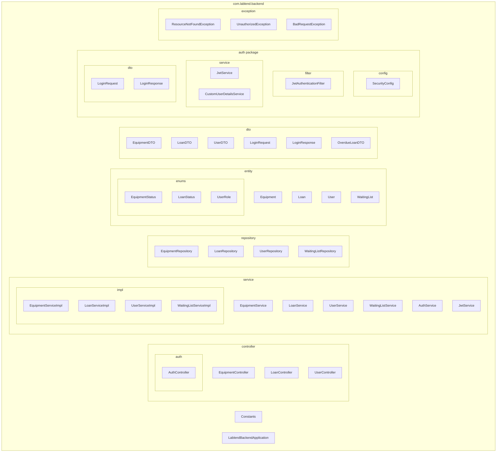

# Backend Architecture Overview

Detailed breakdown of LabLend's backend architecture, design patterns, and code organization.

## Package Structure



## Architectural Layers

### Layer 1: Controllers (REST API Entry Point)

**Responsibility**: Handle HTTP requests and responses

**Key Components**:
- `EquipmentController` — `/api/equipment/*` endpoints
- `LoanController` — `/api/loans/*` endpoints
- `UserController` — `/api/users/*` endpoints
- `AuthController` — `/api/auth/*` endpoints

**Characteristics**:
- Stateless (no session state)
- Validates request input
- Delegates to services
- Returns JSON responses
- Uses `@RestController`, `@RequestMapping`, `@GetMapping`, etc.

**Example**:
```java
@RestController
@RequestMapping("/api/equipment")
public class EquipmentController {
    
    @Autowired
    private EquipmentService equipmentService;
    
    @GetMapping
    public ResponseEntity<?> getAllEquipment(@RequestParam int page, 
                                              @RequestParam int size) {
        return equipmentService.getAllEquipment(page, size);
    }
    
    @PostMapping
    @PreAuthorize("hasRole('ADMIN')")
    public ResponseEntity<?> createEquipment(@RequestBody Equipment equipment) {
        return equipmentService.createEquipment(equipment);
    }
}
```

### Layer 2: Services (Business Logic)

**Responsibility**: Implement business rules and coordinate operations

**Key Components**:
- Service interfaces (define contract)
- Service implementations (actual logic)
- Transaction management (@Transactional)
- Error handling

**Characteristics**:
- Encapsulates business logic
- Coordinates between repositories
- Validates business constraints
- Manages transactions
- Reusable across controllers

**Example**:
```java
@Service
public class LoanServiceImpl implements LoanService {
    
    @Autowired
    private LoanRepository loanRepository;
    @Autowired
    private EquipmentRepository equipmentRepository;
    
    @Transactional
    public Loan createLoan(Long userId, Long equipmentId, LocalDate returnDate) {
        // Check equipment availability
        Equipment equipment = equipmentRepository.findById(equipmentId)
            .orElseThrow(() -> new ResourceNotFoundException("Equipment not found"));
        
        if (!equipment.getStatus().equals(EquipmentStatus.AVAILABLE)) {
            throw new BadRequestException("Equipment not available");
        }
        
        // Check borrowing limit
        long activeLoans = loanRepository.countByUserIdAndStatus(userId, LoanStatus.ACTIVE);
        if (activeLoans >= 3) {
            throw new BadRequestException("Borrowing limit exceeded");
        }
        
        // Create loan
        Loan loan = new Loan();
        loan.setUserId(userId);
        loan.setEquipmentId(equipmentId);
        loan.setLoanDate(LocalDate.now());
        loan.setPlannedReturnDate(returnDate);
        loan.setStatus(LoanStatus.ACTIVE);
        
        // Update equipment status
        equipment.setStatus(EquipmentStatus.IN_USE);
        equipmentRepository.save(equipment);
        
        return loanRepository.save(loan);
    }
}
```

**Key Annotations**:
- `@Service` — Marks as service bean
- `@Transactional` — Manages database transactions
- `@Autowired` — Dependency injection
- `@Override` — Implements interface

### Layer 3: Repositories (Data Access)

**Responsibility**: Handle database operations using JPA

**Key Components**:
- Spring Data JPA interfaces
- Custom query methods
- Entity mapping

**Characteristics**:
- Abstraction over database
- CRUD operations automatically generated
- Custom queries defined as method signatures
- No boilerplate SQL code

**Example**:
```java
@Repository
public interface LoanRepository extends JpaRepository<Loan, Long> {
    
    // Automatically generated CRUD methods:
    // save(), findById(), findAll(), delete(), etc.
    
    // Custom queries
    List<Loan> findByUserIdAndStatus(Long userId, LoanStatus status);
    
    List<Loan> findByEquipmentIdAndStatusNot(Long equipmentId, LoanStatus status);
    
    @Query("SELECT l FROM Loan l WHERE l.plannedReturnDate < CURDATE() AND l.status = 'ACTIVE'")
    List<Loan> findOverdueLoans();
    
    long countByUserIdAndStatus(Long userId, LoanStatus status);
}
```

**Key Annotations**:
- `@Repository` — Marks as data access bean
- `@Query` — Custom JPQL query
- `JpaRepository<Entity, IdType>` — Provides CRUD operations

### Layer 4: Entities (Data Models)

**Responsibility**: Represent database tables as Java objects

**Key Components**:
- JPA entity classes
- Field mappings
- Relationships
- Validation annotations

**Characteristics**:
- Annotated with `@Entity`
- Mapped to database tables
- Include relationships (@OneToMany, @ManyToOne, etc.)
- Support validation (@NotNull, @Email, etc.)

**Example**:
```java
@Entity
@Table(name = "loans")
public class Loan {
    
    @Id
    @GeneratedValue(strategy = GenerationType.IDENTITY)
    private Long id;
    
    @Column(name = "user_id", nullable = false)
    private Long userId;
    
    @Column(name = "equipment_id", nullable = false)
    private Long equipmentId;
    
    @Column(name = "loan_date", nullable = false)
    private LocalDate loanDate;
    
    @Column(name = "planned_return_date", nullable = false)
    private LocalDate plannedReturnDate;
    
    @Column(name = "actual_return_date")
    private LocalDate actualReturnDate;
    
    @Enumerated(EnumType.STRING)
    @Column(name = "status", nullable = false)
    private LoanStatus status;
    
    // Getters and setters
}
```

## Design Patterns

### 1. MVC (Model-View-Controller)

```text
Request → Controller (parses input)
    → Service (processes business logic)
    → Repository (accesses data)
    → Entity (data model)
    ↓
Response ← Controller (formats response)
```

### 2. Repository Pattern

- Abstracts data access logic
- Controllers/Services don't know about database
- Easy to swap implementations (SQL, NoSQL, etc.)
- Facilitates testing with mocks

### 3. Service Layer Pattern

- Centralizes business logic
- Reusable across multiple controllers
- Transactional boundaries
- Error handling

### 4. Dependency Injection

- Spring autowires dependencies
- Loose coupling between components
- Easy to test with mock objects
- Constructor or setter injection

### 5. JWT Token-Based Authentication

- Stateless (no server-side sessions)
- Tokens include user information
- Validated on each request
- Scalable for distributed systems

## Request/Response Flow

### Example: Borrow Equipment

```
1. Client sends HTTP request
   POST /api/loans
   Body: { equipmentId: 1, plannedReturnDate: "2026-05-23" }
   Header: Authorization: Bearer <token>

2. JwtAuthenticationFilter
   - Extract token from header
   - Validate token signature & expiry
   - Load user from token
   - Set security context

3. Spring Security checks @PreAuthorize
   - User is authenticated
   - Continue to controller

4. LoanController.createLoan()
   - Parse request body
   - Validate input
   - Call LoanService.createLoan()

5. LoanServiceImpl.createLoan()
   - Load equipment via EquipmentRepository
   - Check equipment availability
   - Check borrowing limit
   - Create Loan entity
   - Update equipment status
   - Call LoanRepository.save()

6. LoanRepository.save()
   - Convert entity to SQL INSERT/UPDATE
   - Execute database query
   - Return saved entity with ID

7. LoanServiceImpl returns Loan entity

8. LoanController formats response
   - HTTP 201 Created
   - JSON response body

9. Client receives response
   - Status: 201
   - Body: { id: 10, equipmentId: 1, status: "ACTIVE", ... }
```

## Transaction Management

### ACID Properties

**Atomicity**: Operation completes fully or rolls back  
**Consistency**: Database stays in valid state  
**Isolation**: Concurrent operations don't interfere  
**Durability**: Committed data survives failures  

### @Transactional Annotation

```java
@Service
public class LoanServiceImpl {
    
    @Transactional  // Starts transaction at method entry
    public Loan createLoan(...) {
        // Multiple database operations
        loan = loanRepository.save(loan);      // INSERT
        equipment = equipmentRepository.save(equipment);  // UPDATE
        // If exception: rolls back both changes
        // If success: commits both changes
    }
}
```

## Error Handling

### Exception Hierarchy

```text
Exception (Java built-in)
├── RuntimeException
│   ├── BadRequestException (400 errors)
│   ├── UnauthorizedException (401 errors)
│   └── ResourceNotFoundException (404 errors)
└── Checked exceptions
```

### Global Exception Handler

```java
@RestControllerAdvice
public class GlobalExceptionHandler {
    
    @ExceptionHandler(ResourceNotFoundException.class)
    public ResponseEntity<?> handleNotFound(ResourceNotFoundException ex) {
        return ResponseEntity.status(404).body(
            new ErrorResponse(404, "Not Found", ex.getMessage())
        );
    }
    
    @ExceptionHandler(BadRequestException.class)
    public ResponseEntity<?> handleBadRequest(BadRequestException ex) {
        return ResponseEntity.status(400).body(
            new ErrorResponse(400, "Bad Request", ex.getMessage())
        );
    }
}
```

## Dependency Injection

### Constructor Injection (Recommended)

```java
@Service
public class LoanServiceImpl implements LoanService {
    
    private final LoanRepository loanRepository;
    private final EquipmentRepository equipmentRepository;
    
    public LoanServiceImpl(LoanRepository loanRepository, 
                          EquipmentRepository equipmentRepository) {
        this.loanRepository = loanRepository;
        this.equipmentRepository = equipmentRepository;
    }
}
```

**Benefits**:
- Dependencies are immutable
- No null pointer exceptions
- Easy to test with mock objects
- Clear dependencies upfront

### Field Injection (Less Recommended)

```java
@Service
public class LoanServiceImpl {
    
    @Autowired
    private LoanRepository loanRepository;  // Can be null
}
```

---

## Key Technologies

| Component | Technology | Version |
|-----------|-----------|---------|
| **Framework** | Spring Boot | 3.3.5 |
| **ORM** | Spring Data JPA | Latest |
| **Authentication** | Spring Security + JWT | Latest |
| **Database** | MySQL | 8.0 |
| **Build Tool** | Maven | 3.9+ |
| **Testing** | JUnit 5, Mockito | Latest |
| **Logging** | Log4j2 | Latest |

---

**Next**: 
- [Services Layer](services.md)
- [Repositories Layer](repositories.md)
