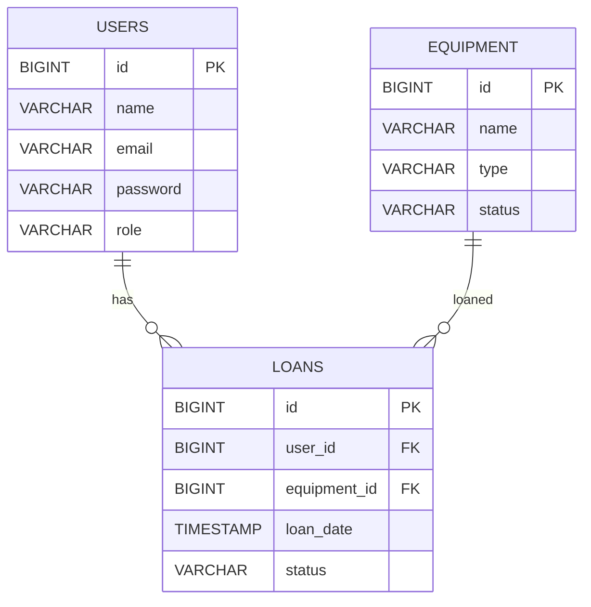

# Database Schema

LabLend database design with entity relationships and performance optimizations.

## Database Diagram



## Tables

### users

```sql
CREATE TABLE users (
  id BIGINT PRIMARY KEY AUTO_INCREMENT,
  name VARCHAR(255) NOT NULL,
  email VARCHAR(255) NOT NULL UNIQUE,
  password VARCHAR(255) NOT NULL,
  role ENUM('STUDENT', 'ADMIN') NOT NULL DEFAULT 'STUDENT',
  created_at TIMESTAMP DEFAULT CURRENT_TIMESTAMP,
  updated_at TIMESTAMP DEFAULT CURRENT_TIMESTAMP ON UPDATE CURRENT_TIMESTAMP
);

CREATE INDEX idx_users_email ON users(email);
```

**Default Admin User**:
```sql
INSERT INTO users (name, email, password, role) VALUES
('Admin User', 'admin@lablend.com', '$2a$10$...', 'ADMIN');
```

### equipment

```sql
CREATE TABLE equipment (
  id BIGINT PRIMARY KEY AUTO_INCREMENT,
  name VARCHAR(255) NOT NULL UNIQUE,
  type VARCHAR(255) NOT NULL,
  status ENUM('AVAILABLE', 'RESERVED', 'IN_USE', 'MAINTENANCE') 
         NOT NULL DEFAULT 'AVAILABLE',
  description VARCHAR(1000),
  location VARCHAR(255),
  serial_number VARCHAR(100),
  created_at TIMESTAMP DEFAULT CURRENT_TIMESTAMP,
  updated_at TIMESTAMP DEFAULT CURRENT_TIMESTAMP ON UPDATE CURRENT_TIMESTAMP
);

CREATE INDEX idx_equipment_status ON equipment(status);
CREATE INDEX idx_equipment_type ON equipment(type);
```

### loans

```sql
CREATE TABLE loans (
  id BIGINT PRIMARY KEY AUTO_INCREMENT,
  user_id BIGINT NOT NULL,
  equipment_id BIGINT NOT NULL,
  loan_date DATE NOT NULL,
  planned_return_date DATE NOT NULL,
  actual_return_date DATE,
  status ENUM('ACTIVE', 'RETURNED', 'OVERDUE') NOT NULL DEFAULT 'ACTIVE',
  created_at TIMESTAMP DEFAULT CURRENT_TIMESTAMP,
  updated_at TIMESTAMP DEFAULT CURRENT_TIMESTAMP ON UPDATE CURRENT_TIMESTAMP,
  
  FOREIGN KEY (user_id) REFERENCES users(id) 
    ON UPDATE CASCADE ON DELETE RESTRICT,
  FOREIGN KEY (equipment_id) REFERENCES equipment(id) 
    ON UPDATE CASCADE ON DELETE RESTRICT,
  
  INDEX idx_loans_user_id (user_id),
  INDEX idx_loans_equipment_id (equipment_id),
  INDEX idx_loans_status (status)
);
```

**Indexes**: Fast queries on `user_id`, `equipment_id`, `status`  
**Foreign Keys**: Maintain referential integrity

### waiting_list

```sql
CREATE TABLE waiting_list (
  id BIGINT PRIMARY KEY AUTO_INCREMENT,
  user_id BIGINT NOT NULL,
  equipment_id BIGINT NOT NULL,
  position INT,
  created_at TIMESTAMP DEFAULT CURRENT_TIMESTAMP,
  
  FOREIGN KEY (user_id) REFERENCES users(id) ON DELETE CASCADE,
  FOREIGN KEY (equipment_id) REFERENCES equipment(id) ON DELETE CASCADE,
  
  UNIQUE KEY uk_waiting_list (user_id, equipment_id),
  INDEX idx_waiting_equipment (equipment_id)
);
```

## Key Relationships

### One-to-Many: User → Loans

```text
One User can have many Loans
One Loan belongs to one User

SELECT * FROM loans WHERE user_id = ?
```

### One-to-Many: Equipment → Loans

```text
One Equipment can be borrowed many times
One Loan involves one Equipment
```

### Many-to-Many: Users ↔ Equipment (through loans)

```text
Users borrow Equipment
Equipment is borrowed by Users
Multiple loans connect them
```

## Constraints & Rules

### Foreign Keys

- `loans.user_id` → `users.id` (ON UPDATE CASCADE, ON DELETE RESTRICT)
  - Updates to user.id cascade to loans
  - Cannot delete user with loans
  
- `loans.equipment_id` → `equipment.id` (ON UPDATE CASCADE, ON DELETE RESTRICT)
  - Updates to equipment.id cascade to loans
  - Cannot delete equipment with loans

### Uniqueness

- `users.email` — Each user has unique email
- `equipment.name` — Each equipment has unique name
- `waiting_list(user_id, equipment_id)` — User can be on waiting list once per equipment

### Enums

```sql
-- Equipment Status
CHECK (status IN ('AVAILABLE', 'RESERVED', 'IN_USE', 'MAINTENANCE'))

-- Loan Status  
CHECK (status IN ('ACTIVE', 'RETURNED', 'OVERDUE'))

-- User Role
CHECK (role IN ('STUDENT', 'ADMIN'))
```

## Performance Optimizations

### Indexes

| Table | Column | Purpose |
|-------|--------|---------|
| users | email | Fast login queries |
| equipment | status | Filter available equipment |
| equipment | type | Search by type |
| loans | user_id | Get user's loans |
| loans | equipment_id | Find loans for equipment |
| loans | status | Find active/overdue loans |
| waiting_list | equipment_id | Check waiting list |

### Query Examples

```sql
-- Find available equipment
SELECT * FROM equipment WHERE status = 'AVAILABLE';

-- Get user's active loans
SELECT * FROM loans WHERE user_id = 5 AND status = 'ACTIVE';

-- Find overdue loans
SELECT * FROM loans 
WHERE planned_return_date < CURDATE() AND status = 'ACTIVE';

-- Get equipment's loan history
SELECT * FROM loans WHERE equipment_id = 1 ORDER BY loan_date DESC;

-- Count user's active loans
SELECT COUNT(*) FROM loans 
WHERE user_id = 5 AND status = 'ACTIVE';
```

---

**Next**: Entity details not included in this build.
